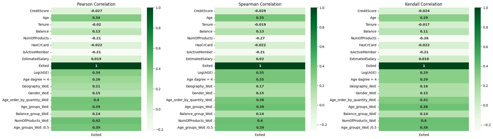

# Classification-Model-Bank-Customer-Churn
This project contains a Jupyter Notebook that demonstrates building and evaluating a classification model using machine learning. The task appears to focus on predicting the likelihood of a customer exiting (or another binary outcome) based on a dataset of features. The model is evaluated using metrics like ROC AUC score.

# Bank Customer Churn Analysis

This project analyzes customer churn in a banking dataset, with the goal of identifying factors that influence customers leaving the bank and providing insights for data-driven decision-making.

---

## Dataset

The dataset contains customer information including:

- **CustomerId** – Unique identifier for each customer  
- **Surname** – Customer's last name  
- **CreditScore** – Credit score of the customer  
- **Geography** – Customer’s country (e.g., France, Germany, Spain)  
- **Gender** – Male or Female  
- **Age** – Age of the customer  
- **Tenure** – Number of years the customer has been with the bank  
- **Balance** – Account balance  
- **NumOfProducts** – Number of bank products used by the customer  
- **HasCrCard** – Whether the customer has a credit card (1 = Yes, 0 = No)  
- **IsActiveMember** – Whether the customer is active (1 = Yes, 0 = No)  
- **EstimatedSalary** – Estimated annual salary  
- **Exited** – Whether the customer has left the bank (1 = Yes, 0 = No)

---

## Usage of WoE (Weight of Evidence)

Weight of Evidence (WoE) is applied to encode categorical variables into continuous measures that reflect the predictive power of each category for churn.  

**Purpose of WoE:**  
- Converts categorical variables into meaningful numerical values for modeling  
- Improves logistic regression assumptions by reducing the impact of extreme values  
- Enables calculation of **Information Value (IV)** to measure the predictive strength of features  

**Example:** transforming `Geography` from categories like France, Germany, Spain into corresponding WoE scores for modeling.

---

## Usage of Correlations

Correlation analysis helps understand relationships between features and the target variable (`Exited`). Three correlation methods are used:

### Screenshot of Correlations

1. **Pearson Correlation** – Measures linear relationships between continuous variables  
   - Example: `Age` vs `Balance`  
   - Appropriate for normally distributed, continuous data  

2. **Spearman Correlation** – Measures monotonic relationships using ranks  
   - Example: `Tenure` vs `NumOfProducts`  
   - Appropriate for ordinal or non-linear monotonic data  

3. **Kendall Correlation** – Measures ordinal association based on concordant and discordant pairs  
   - Example: `HasCrCard` vs `Exited`  
   - Robust to small datasets and tied ranks  

**Reason for using all three:**  
- Pearson captures linear trends  
- Spearman captures monotonic but non-linear trends  
- Kendall handles small sample sizes and ties  
- Ensures no important relationships are missed during exploratory analysis

---

## Usage of GridSearchCV

GridSearchCV is applied for hyperparameter tuning in classification models.  

**Purpose:**  
- Systematically tests combinations of hyperparameters to find the best model performance  
- Improves predictive accuracy and prevents underfitting or overfitting  
- Works with models like Logistic Regression, Random Forest, and XGBoost  

**Example:** tuning `max_depth` and `n_estimators` for a Random Forest classifier using cross-validation.

---

## Analysis Workflow

1. Data cleaning and preprocessing  
2. Encoding categorical variables using **WoE**  
3. Exploratory analysis using **Pearson, Spearman, and Kendall correlations**  
4. Feature selection using correlations and WoE information value  
5. Model training with hyperparameter tuning using **GridSearchCV**  
6. Performance evaluation using accuracy, precision, recall, and AUC metrics  
7. Dashboard creation for visual insights on churn drivers and customer segmentation  

---

## Key Tools

- **Python:** Pandas, NumPy, Matplotlib, Seaborn  
- **Scikit-learn:** Encoding, model building, hyperparameter tuning with GridSearchCV  
- **Streamlit / Plotly:** Interactive dashboards  
- **Statistics:** Correlation analysis, WoE, and hypothesis testing  
- **Business Insights:** Interpreting results to guide customer retention strategies  

The project provides a structured approach to predict customer churn while explaining the contribution of each feature using WoE, correlations, and optimized model parameters via GridSearchCV.
